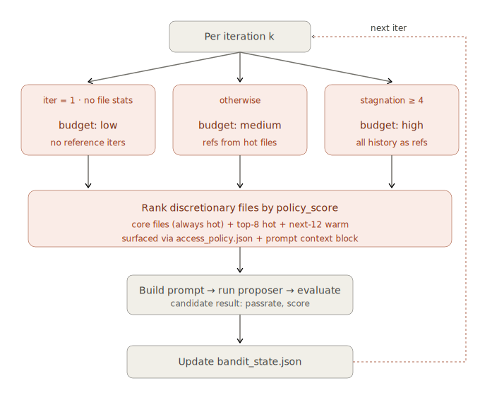

# MemoMemo Optimization Pipeline

This document consolidates, in one place, the MemoMemo proposer/evaluator
optimization loop, the three context-selection policies
(**default / progressive / bandit v3**), and the experimental results
collected so far. After reading it you should be able to:

1. Read `src/memomemo/optimizer.py` and follow the outer loop end-to-end;
2. Make an informed choice between the three policies;
3. Reproduce or extend the existing results on LoCoMo / LongMemEval / SWE-bench mini.

Detailed per-run numbers, cost tables, and the full set of run paths still
live in [`EXPERIMENT_RESULTS.md`](../EXPERIMENT_RESULTS.md) at the repo root;
this document only excerpts the headline numbers.

---

## 0. Shared Skeleton (used by all three policies)

Implemented in `LocomoOptimizer.run()` (`src/memomemo/optimizer.py:152-284`).
`SwebenchOptimizer` inherits the same outer loop and only overrides example
loading, the seed frontier, and candidate evaluation.

The three policies **diverge at exactly two points**: ① how each iteration
picks its budget / reference iterations / file hints, and ② what state it
writes back after evaluation. Everything else (workspace assembly, proposer
invocation, frontier persistence) is identical.



Every iteration writes all of its artifacts to
`runs/<run_id>/proposer_calls/iter_NNN/`. The proposer itself runs inside a
Docker sandbox mounted at `/workspace/`; it cannot see the repository root,
the raw benchmark data, or the scoring helpers — those paths are blocked by
`access_policy.json`.

### 0.1 Per-policy prompt differences

All three policies share the same builder
(`build_progressive_proposer_prompt` in
`src/memomemo/proposer_prompt.py`). The base prompt is identical across
policies — assignment header, objective, available files, edit scope,
quality gate, and the `pending_eval.json` output schema. Three blocks are
**conditionally injected** based on `selection_policy` and the
`adaptive` flag passed by `optimizer.py`:

| Block | default | default+direction | progressive | bandit |
|---|---|---|---|---|
| Base prompt (assignment / objective / files / schema) | ✓ | ✓ | ✓ | ✓ |
| **Optimization Focus** (mechanism direction list) | — | ✓ | ✓ | ✓ |
| **Reference role note** (best iteration(s) / worst iteration) | — | — | ✓ progressive state | ✓ bandit state |
| **Bandit Context Policy** (Hot / Other tracked files, `trace_scope`) | — | — | — | ✓ |

Why the Optimization Focus row distinguishes default from
progressive/bandit: in `LocomoOptimizer.run()` the call site sets
`adaptive=self.config.selection_policy in {"progressive", "bandit"}`
(`optimizer.py:227`), and inside `_run_progressive_proposer_iteration`
the `optimization_directions` argument is filled by
`self._optimization_direction_lines(...)` only when `adaptive` is true
**or** when the new `--include-optimization-direction` CLI flag
(`OptimizerConfig.include_optimization_direction`, default `False`) is
set (`optimizer.py:354-358`). default with the flag off receives an empty
tuple, so the `## Optimization Focus` heading is suppressed entirely;
default with the flag on (the `default+direction` column above) keeps
default's fixed-high context schedule but injects the same direction
list as progressive/bandit, isolating the contribution of the focus
block from the budget heuristic.

Concrete contents per policy:

- **default** — base prompt only. The reference iteration list is the
  full history; no best/worst roles are distinguished, and no mechanism
  direction list is provided. The proposer reads the cumulative
  summaries cold and decides what to try.
- **progressive** — adds (a) the **Optimization Focus** block populated
  from `_optimization_direction_lines(target_system)` (4 cells for the
  memgpt scaffold, 5 for mini-swe-agent), and (b) a one-line
  *Progressive reference roles* note. For `low`/`medium` budget the
  note explicitly lists the best iter(s) (top-k by passrate) and the
  worst iter so the proposer can imitate one and avoid the other; for
  `high` budget it points the proposer at the cumulative summaries to
  identify best/worst itself.
- **bandit** — adds the same Optimization Focus block as progressive,
  plus (a) a *Bandit reference roles* note built from the bandit
  state's best/worst iters, plus (b) a full **Bandit Context Policy**
  block that lists `Hot files to inspect first`
  (core_files + top-8 by `policy_score`), `Other tracked files`
  (next-12 by `policy_score`), and the `trace_scope` derived from the
  budget. The hot/warm lists are explicitly framed as advisory — the
  proposer is told it may still read other files if they fill a
  diagnostic gap.

Reference iteration count and `trace_scope` depth are decided **before**
the prompt is built, by each policy's selection logic in `optimizer.py`
(see §1–§3). The prompt builder only formats whatever the policy chose.

---

## 1. Default Policy (fixed-high baseline)

**Entry point**: `OptimizerConfig.selection_policy = "default"`
(`src/memomemo/optimizer.py:220-221`).

**Decision rule**: every iteration is hard-coded to `budget = "high"`; no
state is ever read or written.



**Properties**:

- Largest context and highest cost per iteration (cache miss + long prompt +
  full copies of every reference iteration).
- No feedback loop: the proposer always sees the same global view.
- Bare prompt: `adaptive=False` is passed to the prompt builder, so
  default does **not** receive the Optimization Focus block, the
  Progressive role hints, or the Bandit Context Policy block. It sees
  only the shared base prompt — assignment / objective / available files
  / edit scope / quality gate / output schema. See §0.1 for the
  per-policy block matrix.
- Serves as a sanity baseline for progressive / bandit.

**`default+direction` ablation** (`--include-optimization-direction`):
keep default's fixed-high context schedule but inject the same
Optimization Focus mechanism direction list as progressive/bandit. The
flag flips
`OptimizerConfig.include_optimization_direction = True`; the rest of the
default decision logic is unchanged. Use this to measure whether the
direction block alone (without the budget tiering or the bandit
file-utility prior) lifts test passrate. On LoCoMo this ablation
*reduces* test (claudekimi default 0.3382 → default+direction 0.3140,
see EXPERIMENT_RESULTS.md §LoCoMo) while inflating cache reads
(2.97M → 4.43M tokens/iter); on LongMemEval it *boosts train* (claudekimi
0.5600 → 0.6500) but the test number is still pending a Together-judge
retry.

---

## 2. Progressive Policy

**Entry point**: `OptimizerConfig.selection_policy = "progressive"`.
**State file**: `runs/<run_id>/progressive_state.json`.

**Core idea**: explicitly modulate context size with three budget tiers
(`low / medium / high`), and **promote / demote between tiers based on
whether the previous iteration produced a Pareto-frontier improvement**. As
soon as an improvement lands, drop back to `low` instead of paying the
`high` token cost iteration after iteration.



| budget | trace_scope | refs                  | prompt length |
|--------|-------------|-----------------------|---------------|
| low    | last1       | best1 + worst         | shortest      |
| medium | last3       | best3 + worst         | medium        |
| high   | all         | full history          | longest       |

**Per-iteration flow**:

1. `_progressive_budget_for_iteration(k)` runs the state machine to pick a budget;
2. `_reference_iterations_for_budget` selects refs for that budget;
3. The workspace is assembled, trimming each ref bundle's `trace_slices`
   according to `trace_scope`;
4. `build_progressive_proposer_prompt` injects
   `selection_policy="progressive"` plus best/worst role hints and the
   Optimization Focus block (memgpt: 4 cells / mini-swe-agent: 5 cells);
5. The proposer runs inside Docker and emits `pending_eval.json`;
6. `_evaluate_proposed` produces a `CandidateResult`;
7. `_update_progressive_state`: did this iteration enter a new frontier?
   If yes → `improved=True`, reset stagnation counter; if no → bump the
   budget tier upward.

**Why this works**: cheap, narrow contexts cast a wide net during the early
iterations; the budget only escalates when the run is genuinely stuck; any
new improvement immediately drops back to `low`. The average per-iteration
cost ends up far below default.

---

## 3. Bandit v3 Policy

**Entry point**: `OptimizerConfig.selection_policy = "bandit"`.
**State file**: `runs/<run_id>/bandit_state.json`.

**Core idea**: treat every readable file in the workspace as the arm of a
multi-armed bandit. Each iteration scores files by "did reading this file
correlate with a positive z-scored reward in the past?", and the top-N
files are pinned into the prompt as `hot` / `warm` so the proposer
immediately attends to the files that have actually paid off.



### 3.1 Top-level decision

When iteration k starts, the optimizer reads `bandit_state.json`:

```
state["files"] = {
    path → {read_iters, success_iters, reward_sum, read_lines,
            write_iters, changed_iters, utility, policy_score, …}
}
```

Files are sorted by `policy_score` (with `required core` files always pinned
into `hot` and excluded from ranking):

- `hot` = core_files + top-8, read budget = 800 lines
- `warm` = next 12, read budget = 300 lines

Budget / `trace_scope` selection:

```
iter == 1 or no file statistics yet      → low / last1 / refs=()
stagnation ≥ bandit_stagnation_threshold (=4)
                                          → high / all / full history refs
otherwise                                 → medium / last3 / (iters where
                                            hot files appeared
                                            ∪ best3 ∪ last_improved, cap 5)
```

### 3.2 Reward (the key change in v3)

```
best_eval_passrate = max(c.passrate for c in evaluated)   # v3: passrate only
history.append(best_eval_passrate)
recent = history[-bandit_reward_window:]                   # default 8;
                                                           # the published v3
                                                           # runs use 16

if not evaluated:
    reward = -clip * 0.25
elif len(recent) < 2:                                      # warm-up
    reward = clip((best_eval_passrate − previous_best) * 10, ±clip)
else:
    μ, σ = mean/std(recent),  σ ≥ 0.02
    reward = clip((best_eval_passrate − μ) / σ, ±clip)     # rolling z-score
success = reward > 0
```

Two changes from v1/v2:

1. **Passrate-only reward**: `average_score` is no longer mixed in. Mixed
   rewards on claudekimi runs were strictly worse on every metric — the
   bandit kept chasing "half-correct" candidates that gained on train but
   did not transfer to test.
2. **Rolling-window z-score**: rewards are normalized against a recent
   window rather than the global best, so a single meaningful rebound
   during a stagnation stretch can still earn a positive score.

### 3.3 Per-file utility update

Once the iteration's reward is determined:

```
For every path the proposer actually read this iteration:
    files[path].read_iters   += 1
    files[path].read_calls   += reads in this iteration
    files[path].read_lines   += lines read in this iteration
    files[path].reward_sum   += this iteration's reward
    if success: files[path].success_iters += 1

For every path that was written or appears in the diff:
    files[path].write_iters   += 1   (written)
    files[path].changed_iters += 1   (in the diff)
    (these do NOT contribute to the reward denominator)
```

`_recompute_bandit_scores` then re-scores globally (only over the "free
read" pool — `required core` is excluded):

```
p_global         = scored_success_iters / scored_read_iters
mean_reward_glob = scored_reward_sum    / scored_read_iters

p_file       = (success_iters + α·p_global) / (read_iters + α)        # Beta-smoothed
mean_reward  = (reward_sum    + α·prior_w·mean_reward_glob)
               / (read_iters + α)
avg_lines    = read_lines / read_iters
cost         = cost_λ · log1p(avg_lines / line_scale)                  # length penalty
bonus        = c · sqrt(log(total_iters + 1) / (read_iters + 1))       # UCB exploration
binary_util  = p_file       - p_global
reward_util  = mean_reward  - mean_reward_glob

policy_score = 0.7·binary_util + 0.3·reward_util − cost + bonus
```

| Hyperparameter                  | Default |
|---------------------------------|--------:|
| `bandit_prior_alpha`            |   2.0   |
| `bandit_prior_weight`           |   0.4   |
| `bandit_exploration_c`          |   0.15  |
| `bandit_cost_lambda`            |   0.05  |
| `bandit_line_scale`             |   500   |
| `bandit_reward_window`          |   8     |
| `bandit_reward_sigma_floor`     |   0.02  |
| `bandit_reward_clip`            |   2.0   |
| `bandit_stagnation_threshold`   |   4     |
| `bandit_failed_iter_penalty`    |   0.5   |

### 3.4 Required core files (always hot, never scored)

`_bandit_core_files` (`src/memomemo/optimizer.py:1951`) keeps a fixed set of
"foundation files" pinned into the hot list regardless of statistics:

- The scaffold source file for the current `source_family`
  (e.g. `memgpt_source.py`);
- `scaffolds/base.py`, `model.py`, `schemas.py`;
- The six summary files under `summaries/`
  (`evolution_summary.jsonl`, `best_candidates.json`,
  `candidate_score_table.json`, `retrieval_diagnostics_summary.json`,
  `diff_summary.jsonl`, `iteration_index.json`);
- `pending_eval.json`.

These files are excluded from bandit scoring so that small-sample noise
cannot demote essential files into warm/cold.

---

## 4. Side-by-side comparison

| Dimension              | default              | progressive                                  | bandit v3                                            |
|------------------------|----------------------|----------------------------------------------|------------------------------------------------------|
| Budget selection       | always `high`        | state machine (`low`→…→`high`)               | heuristic + stagnation threshold (`low/medium/high`) |
| Reference iterations   | full history         | by budget: best k + worst                    | iters where hot files appeared, fallback to best3 / last_improved |
| Trace-scope trim       | `all`                | `last1 / last3 / all`                        | same three tiers, derived from budget                |
| Prompt extras          | base prompt only     | + Optimization Focus + Progressive role hints | + Optimization Focus + Bandit role hints + Bandit Context Policy (hot/warm lists) |
| Feedback signal        | none                 | did this iter enter a new frontier?          | rolling-window z-score (passrate only)               |
| State file             | none                 | `progressive_state.json`                     | `bandit_state.json` (per-file stats)                 |
| Explore vs exploit     | none (always max)    | implicit (only escalates on stagnation)      | explicit (UCB bonus + Beta smoothing)                |
| Cost profile           | highest (every iter is high) | medium (most iters are low)          | medium-high (more reads + policy meta)               |
| Strengths              | reproduces baseline; sanity check | best on LoCoMo/LongMemEval for claudekimi/opus | only policy where codex54 beats progressive on LoCoMo test |
| Weaknesses             | never converges      | hard to drop back from `high` once escalated | needs a warm-up phase; mixed reward overfits train  |

---

## 5. Experimental results summary

Each benchmark below uses a single per-(proposer, policy) table that pairs
passrate (train + test) with per-iteration proposer cost. `input` and
`output` are new tokens billed each turn; `cache reads` is the prompt-cache
hit reused across turns; `tools/iter` is tool-use calls per iteration;
`files/iter` is unique workspace files opened per iteration. A `—` cell
means cost data is unavailable (the train-run dir was deleted, only the
test-eval dir remains). Bold cells flag the strongest result within each
proposer family; ★ marks the overall benchmark best. The `total/iter`
column is the sum of new input + output + cache reads per proposer
iteration — the gross token volume that flows through the proposer per
call. See [`EXPERIMENT_RESULTS.md`](../EXPERIMENT_RESULTS.md) for run
paths and extended notes.

### 5.1 LoCoMo (train=80, test=1449)

The bandit row is the latest sliding-window z-score variant (window=16;
passrate-only reward for claudekimi, mixed reward for codex54). Earlier
bandit variants (v1, v2) are not retained. claude opus has no bandit row
because no v3-era bandit run was completed on opus.

| proposer | policy | train | test | input/iter | output/iter | cache reads/iter | total/iter | tools/iter | files/iter | dur/iter |
|---|---|---:|---:|---:|---:|---:|---:|---:|---:|---:|
| claudekimi | default (docker) | 0.4125 | 0.3382 | 136.4k | 26.8k | 2.97M | 3.13M | 45.8 | 19.9 | 12.3m |
| claudekimi | default+direction (docker) | running | running | — | — | — | — | — | — | — |
| claudekimi | progressive (docker) | **0.4375** | **0.3734** | 138.9k | 25.5k | 1.70M | 1.86M | 35.2 | 15.1 | 13.0m |
| claudekimi | bandit (docker) | 0.4375 | 0.3589 | 104.2k | 29.8k | 1.83M | 1.96M | 35.1 | 17.6 | 14.1m |
| claude opus | default | 0.3875 | 0.3306 | — | — | — | — | — | — | — |
| claude opus | progressive (docker) | **0.4750** | **0.3982** ★ | 3.1k | 20.6k | 1.99M | 2.11M | 61.2 | 20.7 | 8.9m |
| codex54 | default (docker) | 0.4375 | 0.3368 | 1.45M | 23.9k | 1.33M | 2.80M | 33.9 | 16.8 | 8.0m |
| codex54 | progressive (docker) | 0.4250 | 0.3589 | 2.39M | 18.7k | 2.25M | 4.66M | 50.6 | 16.9 | 7.1m |
| codex54 | bandit (docker) | **0.4250** | **0.3865** | 1.13M | 20.7k | 995k | 2.14M | 34.6 | 18.5 | 7.0m |

Highlights:

- **Global best on LoCoMo: claude opus progressive docker, 0.3982 test.**
- progressive wins outright on claudekimi / opus; codex54 is the only
  family where the bandit overtakes progressive (0.3865 test) — also the
  only bandit result on any proposer that beats progressive.
- bandit nearly halves codex54's input cost (input/iter 2.39M → 1.13M)
  with no test regression.
- `default+direction` (`--include-optimization-direction`) is currently
  re-running for claudekimi; the row will be filled once the new test
  number lands.

### 5.2 LongMemEval (train=100, test=400)

bandit rows use the v3 sliding-window z-score reward (window=16,
passrate-only). `default+direction` rows use the new
`--include-optimization-direction` flag.

| proposer | policy | train | test | input/iter | output/iter | cache reads/iter | total/iter | tools/iter | files/iter | dur/iter |
|---|---|---:|---:|---:|---:|---:|---:|---:|---:|---:|
| claudekimi | default | 0.5600 | 0.4700 | 121.5k | 26.9k | 2.12M | 2.27M | 39.6 | 18.4 | 10.3m |
| claudekimi | progressive | **0.6000** | **0.5000** ★ | 105.0k | 25.0k | 1.73M | 1.86M | 33.6 | 16.3 | 9.5m |
| claudekimi | bandit (docker, v3) | running | running | — | — | — | — | — | — | — |
| claudekimi | default+direction | running | running | — | — | — | — | — | — | — |
| codex54 | default | **0.6000** | **0.4875** | 1.77M | 27.4k | 1.61M | 3.41M | 33.4 | 18.8 | 9.5m |
| codex54 | progressive (rerun) | 0.5400 | 0.4725 | 1.45M | 25.0k | 1.33M | 2.80M | 31.9 | 17.0 | 8.3m |
| codex54 | bandit (docker, v3) | 0.5200 | 0.4725 | 1.13M | 24.6k | 1.03M | 2.18M | 34.8 | 19.0 | 8.1m |

Takeaways:

- claudekimi progressive leads test at **0.5000**; codex54 default and
  codex54 v3 bandit tie for second at 0.4875 / 0.4725.
- **codex54 v3 bandit cuts proposer cost ~36%** (input/iter 1.77M →
  1.13M, total/iter 3.41M → 2.18M, dur/iter 9.5m → 8.1m) for only −1.5pt
  test passrate vs default. Same cost-reduction pattern as LoCoMo
  codex54 bandit.
- claudekimi v3 bandit and `default+direction` are both re-running for
  this proposer; their rows will be filled once the new test numbers
  land.
### 5.3 SWE-bench mini

The source-code backend (`mini_swe_agent_source`) is wired into the
optimize CLI (`--swebench`). Two solver models have been run on the same
trainfirst30 pool: mimo v2.5 (default + progressive) and DeepSeek v4 Flash
(bandit only). The SWE-bench train30 pool has no separate test split, so
passrate is reported on the same 30-task pool against each solver's
source baseline.

| proposer | policy | solver | source baseline | best passrate | iters | input/iter | output/iter | cache reads/iter | total/iter | tools/iter | files/iter | dur/iter |
|---|---|---|---:|---:|---:|---:|---:|---:|---:|---:|---:|---:|
| claudekimi | default | mimo v2.5 | 0.4667 | **0.5000** | 20/30 | 136.3k | 28.6k | 3.06M | 3.22M | 56.0 | 23.2 | 13.4m |
| claudekimi | progressive | mimo v2.5 | 0.4000 | **0.5333** | 20/30 | 141.8k | 29.7k | 3.61M | 3.78M | 61.0 | 23.6 | 12.5m |
| claudekimi | bandit (fixedsource) | DeepSeek v4 Flash | 0.5000 | **0.5333** | 19/20 | 128.9k | 26.1k | 3.35M | 3.51M | 56.6 | 25.5 | 12.2m |

DeepSeek bandit reaches the same 0.5333 ceiling as mimo progressive on the
same trainfirst30 pool. The tied bandit frontier candidates were later
promoted to the full DeepSeek v4 Flash evaluation on the 500-problem
verified set (a candidate-level eval, not a (proposer, policy)
optimization row):

| candidate                                                               | resolved/500 | passrate    |
|-------------------------------------------------------------------------|-------------:|------------:|
| source baseline                                                         | 220 / 500    | 0.4400      |
| default optimized (`iter002_stack_trace_context`)                       | 229 / 500    | 0.4580      |
| progressive optimized (`iter016_final_fallback_traceback_retrieval_v1`) | 310 / 500    | 0.6200      |
| bandit fixedsource optimized (`iter013_impact_aware_feedback`)          | 320 / 500    | **0.6400**  |

The bandit fixedsource `iter013_impact_aware_feedback` candidate beats the
source baseline by +20.0 percentage points on full verified, and is the
current strongest SWE-bench result. Full frontier results are in
`runs/swebench_miniswe_deepseek_v4_flash_claudekimi_bandit_v3_fixedsource_iter20_trainfirst30_w10_t900_20260430_233750/test_frontier/test_results.json`.
verified_test10 (10 problems) is too small and saturates too quickly for
the optimizer to make stable improvements.

### 5.4 Overall takeaways

- LoCoMo global best: claude opus progressive docker @ 0.3982 test.
- LongMemEval bandit v3 is now run for both proposer families: codex54
  bandit ties progressive at 0.4725 test while cutting proposer cost
  ~36%; claudekimi bandit is currently re-running before its row is
  filled in.
- Best LongMemEval test remains **claudekimi progressive at 0.5000**;
  codex54 default 0.4875 and codex54/v3 bandit 0.4725 follow.
- On LoCoMo, progressive is the safe winner for claudekimi / opus;
  codex54 is the only family that benefits from the bandit policy.
- train80 LoCoMo on its own is too noisy and should always be paired with
  test 1449; claudekimi bandit (train 0.4375 / test 0.3589 vs progressive
  0.4375 / 0.3734) is the clearest example of train/test inconsistency.
- `--include-optimization-direction` (`default+direction`) is currently
  re-running on both LoCoMo and LongMemEval claudekimi; verdict pending
  the rerun.
- The first real optimization signal on SWE-bench mini comes from
  progressive: trainfirst30 0.5333 (vs baseline 0.4667). The strongest
  full verified result is now DeepSeek Flash bandit fixedsource at
  0.6400 (vs baseline 0.4400).
- All progressive / bandit results above use the docker sandbox;
  non-docker results are not counted.
